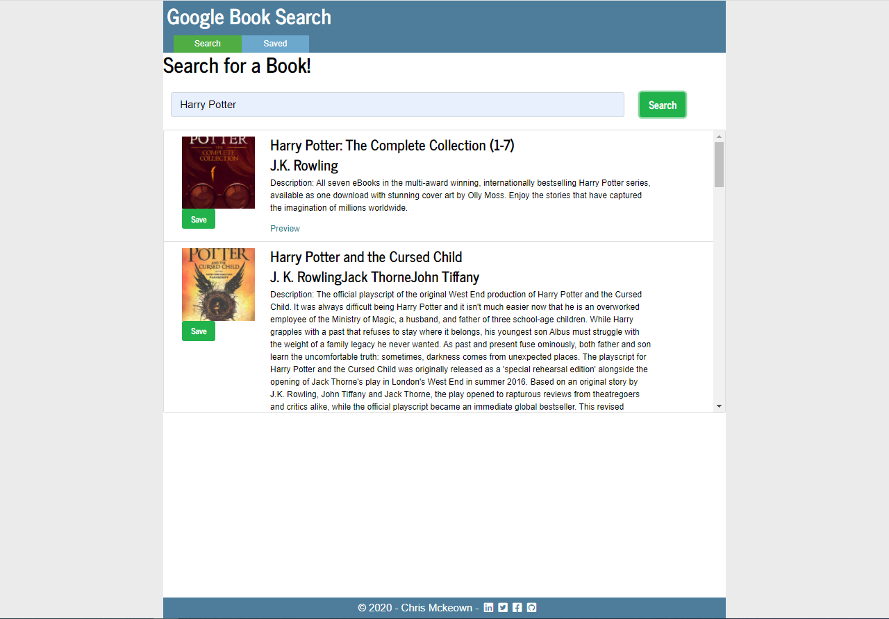

# Google Books React Search


[](https://github.com/chrisjmckeown/Google_Books_React_Search/blob/master/LICENSE)[](https://GitHub.com/chrisjmckeown/Google_Books_React_Search/graphs/contributors/)[](https://GitHub.com/chrisjmckeown/Google_Books_React_Search/pull/)

## Description

This is a React-based Google Books Search app allows users not only search for books but save books to review or purchase later.

## Table of Contents

- [Installation](#Installation)
- [Usage](#Usage)
- [License](#License)
- [Contributing](#Contributing)
- [Tests](#Tests)
- [Questions](#Questions)

## Installation

1. Download and install [Node.js](http://nodejs.org/) (that will install npm as well)
2. CD to client folder.
3. Install the dependancies.<br />
   ```
   npm install
   ```
4. You are done for the setup, run the app using
   ```
   yarn start
   ```

### Technologies Utilized


   

## Usage

Once installed:

- To run the Google Book Search locally, use:

```
   yarn start
```

<h3>The Google Book Search app:</h3>

* Search for books viewing their:

    - `title` - Title of the book from the Google Books API

    - `authors` - The books's author(s) as returned from the Google Books API

    - `description` - The book's description as returned from the Google Books API

    - `image` - The Book's thumbnail image as returned from the Google Books API

    - `link` - The Book's information link as returned from the Google Books API

* Save books to view at a later date.

Home page:


### Heroku Deployment

View the deployed app here: [deployed app](https://fast-escarpment-47591.herokuapp.com/)

## License

Pull requests are welcome. For major changes, please open an issue first to discuss what you would like to change.

[](https://github.com/chrisjmckeown/Google_Books_React_Search/blob/master/LICENSE)

## Contributing

[](code_of_conduct.md)

## Tests

Run the application, search and save to see results.

## Questions

- Follow me at: <a href="https://github.com/chrisjmckeown" target="_blank">https://github.com/chrisjmckeown</a>
- Please email with any question at: chris.j.mckeown@hotmail.com

© 2021 chrisjmckeown
